## 1. WordClouds and TF IDFs

A set of short text-items was chosen, dealing with a common topic of interest - Brexit.
The text-items were stored in a list, their stopwords removed, normalised and lemmatized to form the following final list

<table><tr><td>
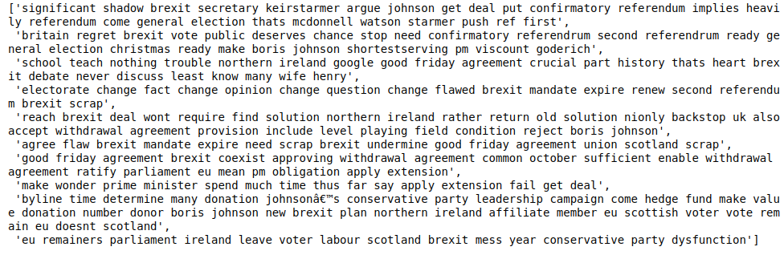
</td></tr>
</table>

*We calculated the TF scores for all these words, and a wordcloud is shown for these words.*

Term Frequency (TF) - refers to the count or frequency of the word, in a given document. The TF was calculated using the CountVectorizer method provided in the sklearn package.

A snapshot of the matrix and wordcloud generated from TF scores is as follows:

<table><tr><td>
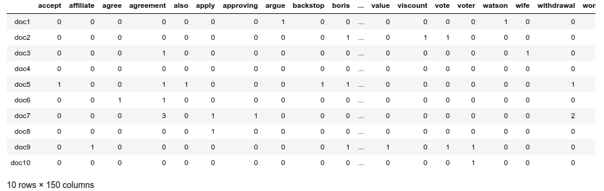
</td></tr>
</table>

As we can see, the term frequency for terms like Brexit, agreement, Johnson, Ireland, change and referendum are high - thus being more prominent in the Word Cloud.

<table align="center"><tr><td>
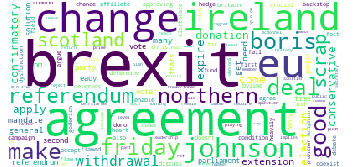
</td></tr>
</table>

After calculating TF (Term Frequency), we calculate the IDF scores for all text-items in each document, which gives a higher score to text-items that are rare across all documents. On multiplying the TF and IDF scores - we get the TF-IDF score which are scores that signify the importance of a text-item in the text. We use the TfidfTransformer method from sklearn for calculating idf and tf-idf scores.

The matrix of TF-IDF scores for the above set of tweets is as follows:

<table align="center"><tr><td>
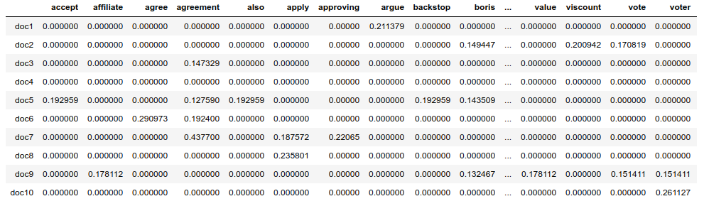
</td></tr>
</table>

Next, to represent the tf-idf scores,all the scores for every text-item are aggregated, and then it is provided as a frequency to the wordcloud. The sum of relevant tf-idfs are provided:

<table align="center"><tr><td>
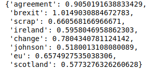
</td></tr>
</table>
<table align="center"><tr><td>
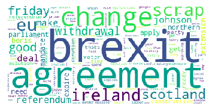
</td></tr>
</table>

Similar to the above, we can see the most important text-items in the corpus are displayed prominently.

## 2. PMI

PMI (Pointwise Mututal Information) scores are used to find the words co-occurring together more frequently as opposed to occurring individually. A simple formula for achieving this for every text-item is:

</a>

where P(w1,w2) is the probability of 2 text-items appear together, while P(w1) and P(w2) are probabilities of the words appearing separately.

PMI scores of bigrams in the corpus was calculated, and the top pairs are as follows: 

<table align="center"><tr><td>
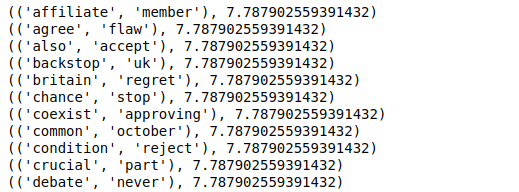
</td></tr>
</table>

However, we can see that the PMI scores are the same for all of these pairs, and not all of them might always appear together in the corpus if the corpus were larger - this is a flaw of PMI, as it over-estimates low-frequency text-items. For eg, if a bi-gram - ‘affiliate member’ appears only once throughout the corpus, with the individual unigrams being also present only once, it’ll have a high PMI score which is due to its low frequency.

To overcome that, we increase the minimum cut-off frequency to 2, and the top pairs which appear at least twice are as follows: 

<table align="center"><tr><td>
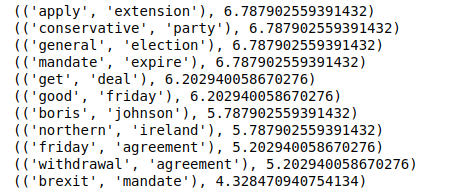
</td></tr>
</table>

The terms like ‘conservative party, ‘general election’, ‘good friday’, ‘boris johnson’ and ‘northern ireland’ nearly always appear together in the corpus, and their co-occurrence makes sense

## Spam Tweet v Regular Tweet using Entropy

Entropy has been used to determine whether tweet set is interesting (contains variety) or repetitive (spam). Two sets of 10 made-up tweets were chosen: 
* spam-set: where the 10 tweets are very similar containing an advert for a product 
* random-set: where the 10 tweets are very different, chosen at random from Twitter.

A set of tweets from the SamsungMobile page was used for the spam set:
<table align="center"><tr><td>
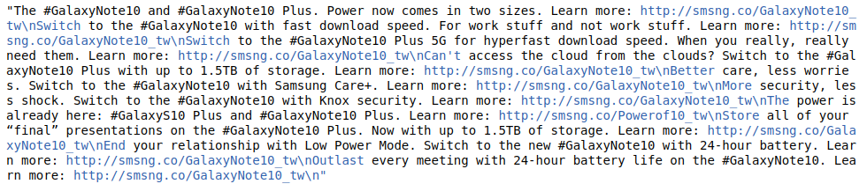
</td></tr>
</table>
A set of random tweets taken:
<table align="center"><tr><td>
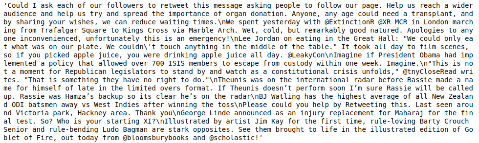
</td></tr>
</table>

Both the spam and random tweet sets had their stopwords removed.
The formula for entropy calculation is:

Where A is the word frequency in the document, and a is the text- item.
The FreqDist function calculates the frequency of the text-items within a text. We calculate the probabilities from the frequency distribution, and we return the entropy according to the above formula.
<table align="center"><tr><td>
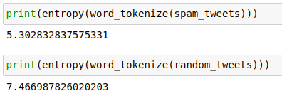
</td></tr>
</table>

The spam set has a much lower entropy than the random set of tweets - which is expected. 

## References
Bird, S., Klein E. and Loper E. (2009). *Natural Language Processing with Python: Analyzing Text with the Natural Language Toolkit.* Sebastopol: O'Reilly Media, Inc.